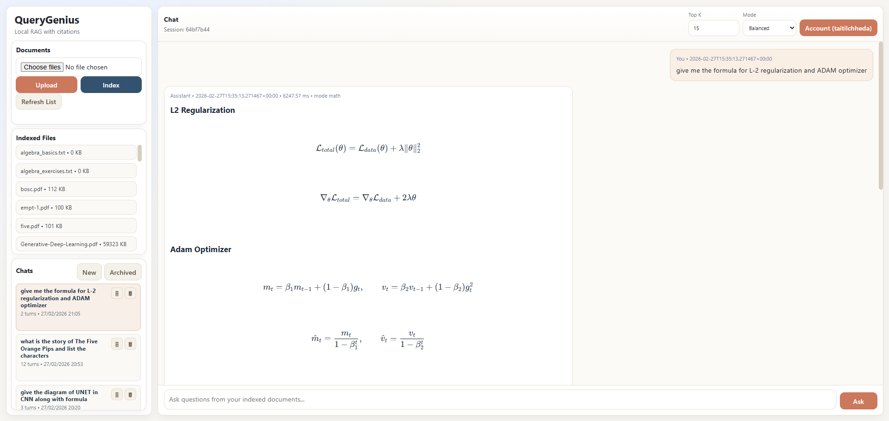
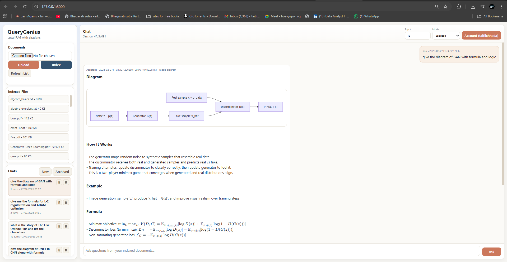
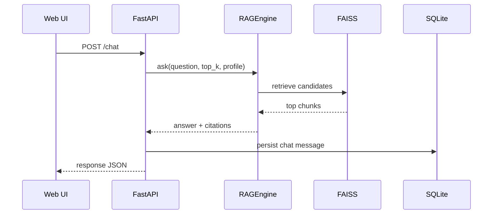
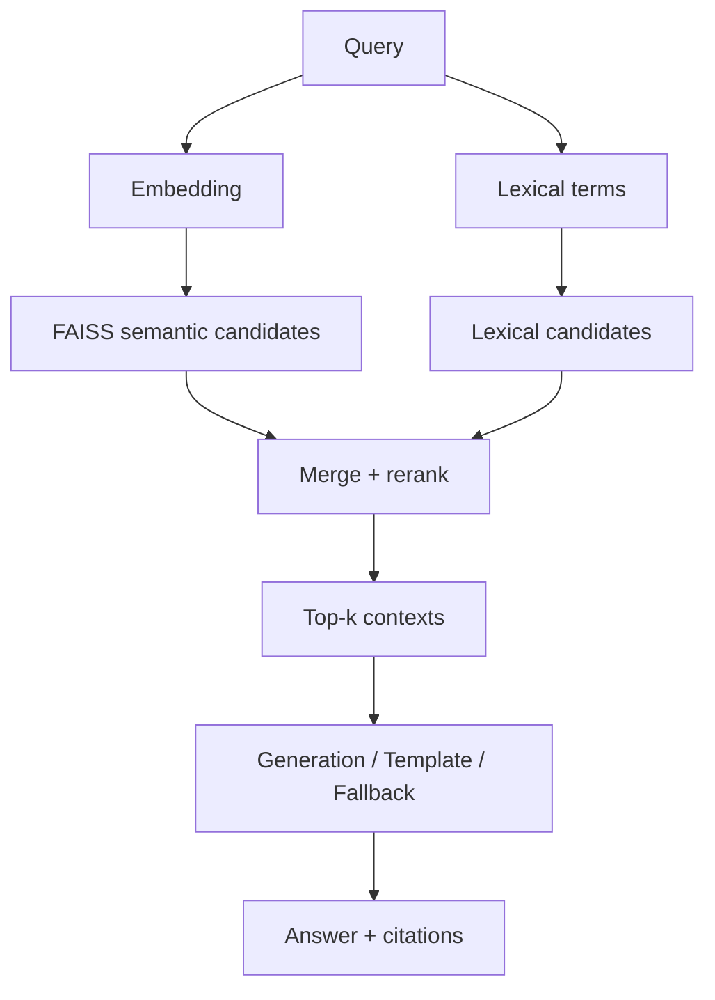

# QueryGenius v2

QueryGenius is a local-first RAG assistant for PDF/TXT/MD Q&A with citations, diagram rendering, and LaTeX-style formula rendering.

## Screenshots




## Core Features

- Ingest local docs: `.txt`, `.md`, `.pdf`
- Chunk + embed with `sentence-transformers/all-MiniLM-L6-v2`
- FAISS local vector index with disk persistence
- FastAPI backend + modern web UI
- Source-grounded answers with citations (`source + chunk_id + score`)
- Diagram responses (Mermaid + fallback renderer + zoom on click)
- Formula responses rendered with KaTeX
- Chat sessions with archive/delete
- Local auth (register/login/logout)
- Evaluation script (Recall@1/3/5 + latency)

## Project Structure

```text
querygenius-v2/
  README.md
  requirements.txt
  .env.example
  data/
    raw/
    processed/
    index/
    eval/
  src/
    ingest.py
    rag.py
    api.py
    eval.py
    utils.py
    static/
      index.html
      styles.css
      app.js
  tests/
    test_rag.py
```

## Quick Start (Windows)

```powershell
cd querygenius-v2
python -m venv .venv
.\.venv\Scripts\Activate.ps1
pip install --upgrade pip
pip install -r requirements.txt
copy .env.example .env
```

## Add Documents and Build Index

1. Put files into `data/raw/`
2. Build/rebuild index:

```powershell
python -m src.ingest --rebuild
```

Generated artifacts:
- `data/processed/chunks.jsonl`
- `data/index/faiss.index`
- `data/index/metadata.json`

## Run App

```powershell
uvicorn src.api:app --reload
```

Open:
- `http://127.0.0.1:8000/`

## API (Important Endpoints)

- `GET /health`
- `GET /documents`
- `POST /upload`
- `POST /ingest`
- `POST /ask`
- `POST /chat`
- `POST /auth/register`
- `POST /auth/login`
- `GET /auth/me`
- `GET /chats`
- `POST /chats`
- `PATCH /chats/{session_id}`
- `DELETE /chats/{session_id}`

## Minimal cURL Examples

```bash
curl -X POST "http://127.0.0.1:8000/ask" \
  -H "Content-Type: application/json" \
  -d '{"question":"What is self-attention?","top_k":5}'
```

```bash
curl -X POST "http://127.0.0.1:8000/chat" \
  -H "Content-Type: application/json" \
  -d '{"question":"give the diagram of GAN with formula and logic","top_k":5}'
```

## Evaluation

```powershell
python -m src.eval
```

Uses:
- `data/eval/eval_questions.json`

Outputs:
- Recall@1 / Recall@3 / Recall@5
- avg retrieval/generation/total latency
- `data/eval/report.json`

## Essential Config (`.env`)

- `QG_EMBEDDING_MODEL`
- `QG_EMBEDDING_DEVICE` (`cuda` or `cpu`)
- `QG_ENABLE_LLM`
- `QG_LLM_MODEL`
- `QG_MAX_NEW_TOKENS`
- `QG_MAX_NEW_TOKENS_DIAGRAM`
- `QG_STRICT_GROUNDED`
- `QG_ENFORCE_SOURCE_FOCUS`

## GPU Check

```bash
curl http://127.0.0.1:8000/health
```

Look for:
- `"cuda_available": true`

## Troubleshooting

- Wrong references: run `python -m src.ingest --rebuild`
- Formula not rendered: restart API + hard refresh (`Ctrl+F5`)
- Diagram not rendered: Mermaid CDN issue; fallback should still show
- Slow responses: verify CUDA, reduce `top_k`, reduce `QG_MAX_NEW_TOKENS`

## Test

```powershell
pytest -q
```

## Next README Pass

If you want, the next README pass can include:
- sequence diagrams for API and retrieval internals
- benchmark tables for CPU vs RTX 3060
- deployment profile for LAN usage (single-machine + multi-user)

## Sequence Diagrams

### API Flow (`/chat`)



### Retrieval Internals



## Benchmark Table Templates (CPU vs RTX 3060)

| Profile | Model | Device | top_k | Retrieval ms | Generation ms | Total ms |
|---|---|---|---:|---:|---:|---:|
| balanced | Qwen2.5-3B-Instruct | RTX 3060 | 5 | 3975.16 | 0.62 | 3976.04 |
| math | Qwen2.5-3B-Instruct | RTX 3060 | 5 | 2323.10 | 0.05 | 2323.39 |
| diagram | Qwen2.5-3B-Instruct | RTX 3060 | 5 | 2341.71 | 0.05 | 2341.98 |
| balanced | Qwen2.5-3B-Instruct | CPU | 5 | 2314.03 | 0.55 | 2314.84 |
| math | Qwen2.5-3B-Instruct | CPU | 5 | 2275.39 | 0.05 | 2275.68 |
| diagram | Qwen2.5-3B-Instruct | CPU | 5 | 2316.49 | 0.04 | 2316.76 |

| Eval Set | Device | Recall@1 | Recall@3 | Recall@5 |
|---|---|---:|---:|---:|
| `data/eval/eval_questions.json` | RTX 3060 | 0.3333 | 0.3333 | 0.3333 |
| `data/eval/eval_questions.json` | CPU | 0.3333 | 0.3333 | 0.3333 |

Benchmark notes:
- Latency values are averages of 3 runs per profile using the current local corpus.
- These runs used deterministic/template-heavy prompts and `QG_ENABLE_LLM=0` (retrieval-focused measurement).
- Exact values will vary with corpus size, model warmup state, and concurrent system load.

## LAN Deployment Profiles

### Single-machine local
- Command: `uvicorn src.api:app --reload --host 127.0.0.1 --port 8000`
- Access: `http://127.0.0.1:8000`

### Multi-user LAN
- Command: `uvicorn src.api:app --host 0.0.0.0 --port 8000 --workers 1`
- Access: `http://<HOST_LAN_IP>:8000`
- Open Windows firewall inbound TCP for port `8000`

### Reverse-proxy (optional)
- Put Nginx/Caddy in front of FastAPI
- Terminate TLS at proxy
- Restrict access to trusted LAN CIDR/IP ranges
