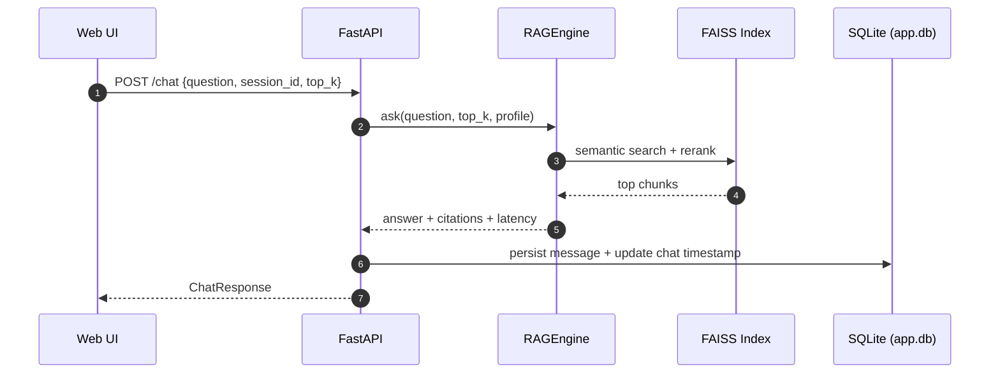
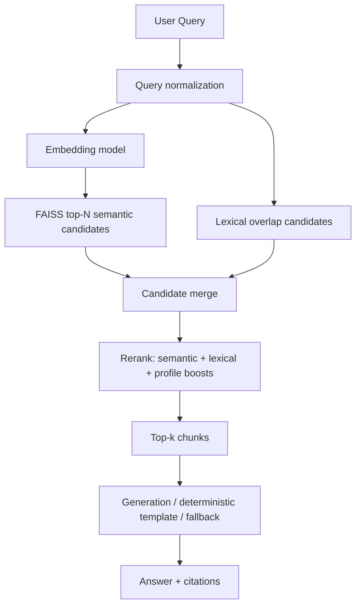

# QueryGenius v2

QueryGenius is a local-first Retrieval-Augmented Generation (RAG) assistant for document Q&A with citations, math rendering, and diagram rendering.

It is designed for:
- Windows + Python 3.10+
- RTX 3060 12GB (CUDA) with CPU fallback
- Offline runtime after first model download

## 1. What You Get

- Local document ingestion: `.txt`, `.md`, `.pdf`
- Chunking + embeddings + FAISS indexing
- FastAPI backend with web UI
- Session/chat management with archive/delete
- Local auth (register/login/logout)
- Retrieval with source citations (`file + chunk + score`)
- Diagram responses (Mermaid + fallback renderer)
- Formula responses rendered with KaTeX
- Evaluation script: Recall@1/3/5 + latency report

## 2. Repository Layout

```text
querygenius-v2/
  README.md
  requirements.txt
  .env.example
  data/
    raw/               # source docs
    processed/         # chunks, db, reports
    index/             # faiss + metadata
    eval/              # eval set + reports
  src/
    __init__.py
    ingest.py          # parsing + chunking + indexing
    rag.py             # retrieval + answer generation
    api.py             # FastAPI app + auth/chat endpoints
    eval.py            # evaluation runner
    utils.py           # shared models/helpers
    static/
      index.html
      styles.css
      app.js
  tests/
    test_rag.py
```

## 3. End-to-End Pipeline

```text
Raw files -> Parse -> Chunk -> Embed -> FAISS index
                                      |
                                Query embedding
                                      |
                      Hybrid retrieval + reranking
                                      |
                         Answer generation/fallback
                                      |
                          Citation-rich response
```

## 4. Quick Start (Windows)

```powershell
cd querygenius-v2
python -m venv .venv
.\.venv\Scripts\Activate.ps1
pip install --upgrade pip
pip install -r requirements.txt
copy .env.example .env
```

### Add documents
Place your files in `data/raw/`.

### Build index
```powershell
python -m src.ingest --rebuild
```

### Start API + UI
```powershell
uvicorn src.api:app --reload
```

Open:
- `http://127.0.0.1:8000/`

## 5. Runtime Artifacts

After ingestion, QueryGenius creates:
- `data/processed/chunks.jsonl` (chunk metadata + content)
- `data/index/faiss.index` (vector index)
- `data/index/metadata.json` (index metadata)
- `data/processed/app.db` (users/chats/messages)

## 6. Retrieval and Generation Strategy

### Retrieval
QueryGenius uses hybrid retrieval:
- Semantic vector search (FAISS)
- Lexical overlap candidates
- Reranking with profile-aware boosts
- Optional source-focus to reduce cross-document mixing

### Profiles
The system resolves profile automatically from query intent:
- `balanced`: general QA
- `math`: equations, derivations, formulas
- `diagram`: architectures, block diagrams, flow diagrams

### Answering behavior
- If LLM is available: grounded generation from retrieved context
- If LLM unavailable/weak: extractive fallback
- For known intents (CNN/LSTM/Transformer/GAN/BCE/Backprop/etc.), deterministic templates are used for quality and formatting consistency

## 7. API Reference

### Health
- `GET /health`
- Returns status + CUDA visibility

### Documents
- `GET /documents`
- `POST /upload` (multipart, field: `files`)
- `POST /ingest`
- `GET /index-info`

### Q&A
- `POST /ask`
- `POST /chat` (session-aware)

### Auth
- `POST /auth/register`
- `POST /auth/login`
- `POST /auth/logout`
- `GET /auth/me`

### Chats
- `GET /chats?archived=false`
- `POST /chats`
- `PATCH /chats/{session_id}`
- `DELETE /chats/{session_id}`
- `GET /chats/{session_id}/messages`

### History
- `GET /history`
- `GET /history/sessions`

## 8. Request/Response Examples

### Ask
```bash
curl -X POST "http://127.0.0.1:8000/ask" \
  -H "Content-Type: application/json" \
  -d '{"question":"What is self-attention?","top_k":5,"retrieval_profile":"balanced"}'
```

### Chat
```bash
curl -X POST "http://127.0.0.1:8000/chat" \
  -H "Content-Type: application/json" \
  -d '{"question":"diagram of transformer with self-attention formula","top_k":5}'
```

### Register/Login
```bash
curl -X POST "http://127.0.0.1:8000/auth/register" \
  -H "Content-Type: application/json" \
  -d '{"email":"you@example.com","password":"strong_password"}'
```

```bash
curl -X POST "http://127.0.0.1:8000/auth/login" \
  -H "Content-Type: application/json" \
  -d '{"email":"you@example.com","password":"strong_password"}'
```

## 9. Web UI Features

- Document upload and index rebuild
- Document list with scroll handling
- Chat history list with archive/delete icon actions
- Session switching and persistent history
- Account menu (guest vs signed-in state)
- Formula rendering via KaTeX
- Diagram rendering via Mermaid with fallback
- Diagram zoom modal on click
- Typewriter reveal for assistant messages

## 10. Environment Variables (`.env`)

### Embeddings
- `QG_EMBEDDING_MODEL=sentence-transformers/all-MiniLM-L6-v2`
- `QG_EMBEDDING_DEVICE=cuda|cpu`
- `QG_USE_HASH_EMBEDDINGS=0|1`

### Generation
- `QG_ENABLE_LLM=1|0`
- `QG_LLM_MODEL=Qwen/Qwen2.5-3B-Instruct` (default in current setup)
- `QG_MAX_NEW_TOKENS=160`
- `QG_MAX_NEW_TOKENS_DIAGRAM=280`
- `QG_TEMPERATURE=0.0`
- `QG_TOP_P=1.0`

### Context Budget
- `QG_MAX_CONTEXT_CHARS=12000`
- `QG_MAX_CHUNK_CONTEXT_CHARS=2000`

### Grounding / Retrieval Quality
- `QG_STRICT_GROUNDED=1`
- `QG_MIN_RETRIEVAL_SCORE=0.18`
- `QG_MIN_QUERY_OVERLAP=0.22`
- `QG_ENFORCE_SOURCE_FOCUS=1`

### OCR for scanned PDFs
- `QG_ENABLE_OCR=1|0`
- `QG_OCR_MIN_PAGE_CHARS=80`
- `QG_OCR_MAX_PAGES=40`
- `QG_OCR_DPI=180`
- `QG_OCR_LANG=eng`
- `QG_TESSERACT_CMD=` (set absolute path if needed)

## 11. GPU Setup (RTX 3060)

### Verify GPU at runtime
```bash
curl http://127.0.0.1:8000/health
```
Expected:
- `"cuda_available": true`
- `"device": "NVIDIA GeForce RTX 3060"` (or equivalent)

### If CUDA is false
- Install CUDA-enabled PyTorch in the same `.venv`
- Confirm NVIDIA driver + CUDA runtime
- Restart server

## 12. OCR Setup (Windows)

1. Install Tesseract OCR
2. Add to PATH or set `.env`:
   - `QG_TESSERACT_CMD=C:\Program Files\Tesseract-OCR\tesseract.exe`
3. Rebuild index:
```powershell
python -m src.ingest --rebuild
```

## 13. Evaluation

Run:
```powershell
python -m src.eval
```

Input:
- `data/eval/eval_questions.json`

Output:
- `Recall@1`
- `Recall@3`
- `Recall@5`
- avg latency (`embedding+retrieval`, `generation`, `total`)
- JSON report at `data/eval/report.json`

### Eval schema
```json
[
  {
    "question": "...",
    "expected_sources": ["filename.pdf"],
    "expected_keywords": ["..."]
  }
]
```

## 14. Testing

```powershell
pytest -q
```

Current coverage validates:
- retrieval behavior
- `/ask` fallback flow
- upload + `/chat` + history persistence

## 15. Troubleshooting

### A) Wrong sources mixed in answers
- Rebuild index with `--rebuild`
- Check `GET /index-info`
- Keep `QG_ENFORCE_SOURCE_FOCUS=1`

### B) Formulas show as plain text
- Hard refresh (`Ctrl+F5`)
- Confirm assistant output contains delimiters (`\[ ... \]` / `\( ... \)`)
- Restart server after updates

### C) Mermaid diagram not rendering
- Verify internet access to Mermaid CDN
- Fallback visual diagram should still display
- Click diagram to open zoom modal

### D) Slow responses
- Verify CUDA in `/health`
- Reduce `top_k`
- Reduce `QG_MAX_NEW_TOKENS`
- Use smaller/faster model

### E) Auth errors
- `401`: wrong email/password
- `409`: email already registered
- `422`: invalid payload format

## 16. Model Notes and Switching

Default embedding model:
- `sentence-transformers/all-MiniLM-L6-v2`

Default LLM (current project config):
- `Qwen/Qwen2.5-3B-Instruct`

Possible alternatives if GPU allows:
- `microsoft/phi-2`
- `google/gemma-2b` variants (compatible instruct versions)

To switch:
1. Update `.env` (`QG_LLM_MODEL=...`)
2. Restart API
3. First request downloads model; after that, runs locally/offline

## 17. Security and Data Scope

- All uploaded docs remain local in `data/raw/`
- FAISS index and chat DB are local files
- No external vector DB is required
- CDN assets used by frontend (Mermaid/KaTeX) require internet unless self-hosted

## 18. Development Notes

Useful commands:
```powershell
python -m src.ingest --rebuild
python -m src.eval
uvicorn src.api:app --reload
pytest -q
```

## 19. License / Usage

Add your preferred license file before distribution.

## 20. Sequence Diagrams

### API Request Lifecycle (`/chat`)



### Retrieval Internals



## 21. Benchmark Table Templates (CPU vs RTX 3060)

Use this table format to track performance after changes.

### Inference Benchmark Template

| Profile | Model | Device | top_k | Avg Retrieval (ms) | Avg Generation (ms) | Avg Total (ms) | Notes |
|---|---|---|---:|---:|---:|---:|---|
| balanced | Qwen2.5-3B-Instruct | RTX 3060 | 5 | - | - | - | |
| math | Qwen2.5-3B-Instruct | RTX 3060 | 5 | - | - | - | |
| diagram | Qwen2.5-3B-Instruct | RTX 3060 | 5 | - | - | - | |
| balanced | Qwen2.5-3B-Instruct | CPU | 5 | - | - | - | |
| math | Qwen2.5-3B-Instruct | CPU | 5 | - | - | - | |
| diagram | Qwen2.5-3B-Instruct | CPU | 5 | - | - | - | |

### Retrieval Quality Template

| Dataset | Device | Recall@1 | Recall@3 | Recall@5 | Avg Total Latency (ms) |
|---|---|---:|---:|---:|---:|
| `data/eval/eval_questions.json` | RTX 3060 | - | - | - | - |
| `data/eval/eval_questions.json` | CPU | - | - | - | - |

## 22. LAN Deployment Profiles

### Profile A: Single-Machine (Local Only)
- Use case: one user, local desktop/laptop.
- Command:
  - `uvicorn src.api:app --reload --host 127.0.0.1 --port 8000`
- Access:
  - `http://127.0.0.1:8000`

### Profile B: Multi-User on Local Network
- Use case: one GPU host serving multiple users in same LAN.
- Command:
  - `uvicorn src.api:app --host 0.0.0.0 --port 8000 --workers 1`
- Access:
  - `http://<HOST_LAN_IP>:8000`
- Windows Firewall:
  - Allow inbound TCP on port `8000`.
- Notes:
  - Keep workers at `1` if model loading is heavy and GPU memory constrained.
  - Use strong account passwords for shared LAN usage.

### Profile C: Production-Like Reverse Proxy (Optional)
- Place Nginx/Caddy in front of FastAPI.
- Terminate TLS at proxy.
- Restrict origin/IP ranges for internal network.

## 23. Screenshots

Screenshots can be stored under:
- `docs/screenshots/`

Suggested files:
- `docs/screenshots/dashboard.png` (home + sidebar)
- `docs/screenshots/chat-formula.png` (formula rendering)
- `docs/screenshots/chat-diagram.png` (diagram + zoom modal)
- `docs/screenshots/account-menu.png` (account/settings/logout)

Markdown embedding template:

```md


```
